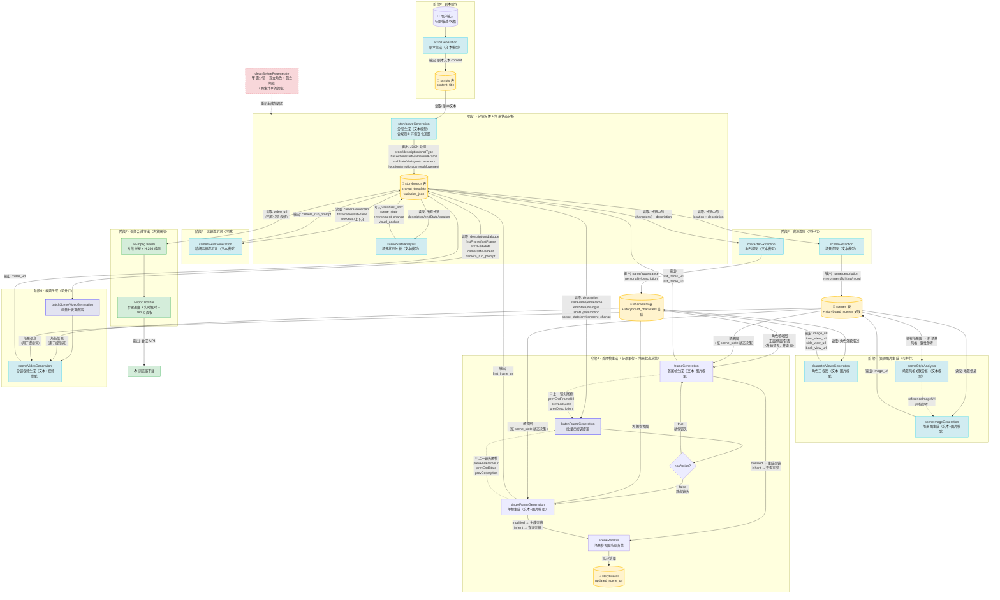
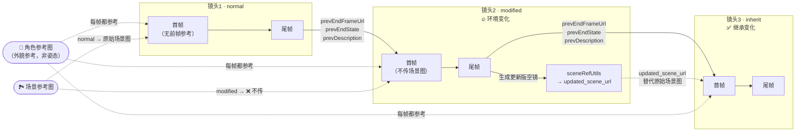

# NanoStory 视频生成全流程图

## 总体流程（Mermaid）



## 阶段依赖关系矩阵

| 阶段 | 依赖的上游 | 并行/串行 | 说明 |
|---|---|---|---|
| 0. 剧本生成 | 无 | - | 用户触发 |
| 1. 分镜拆解 | 剧本 | - | 将剧本拆为镜头序列，含环境变化追踪规范 |
| 1.5 场景状态分析 | 分镜 | - | 分析每个镜头的 scene_state / environment_change / visual_anchor |
| 2. 资源提取 | 分镜 | **角色/场景可并行** | 从分镜中提取角色和场景实体 |
| 3. 资源图片 | 角色信息 + 场景信息 | **角色图/场景图可并行** | 场景图之间有风格关联依赖 |
| 4. 首尾帧 | 分镜 + 角色图 + 场景图 + 场景状态 | **必须串行**（链式） | 按 scene_state 动态决策参考图，modified 后生成空镜 |
| 5. 运镜提示词 | 首尾帧 + 分镜 | 可并行 | 可选步骤 |
| 6. 视频生成 | 首尾帧 + 运镜 + 分镜 | **可并行**（并发池） | 每个镜头独立生成视频 |
| 7. 视频合成导出 | 所有分镜视频 | - | 浏览器端 FFmpeg.wasm 拼接，含步骤进度和 debug 日志 |

## 阶段4 首尾帧串行链式详解



## 场景参考图动态决策（scene_state 三态）

| scene_state | 场景参考图 | 提示词 |
|-------------|-----------|--------|
| `normal` | 原始场景图 | 标准约束 |
| `modified` | **不传**（靠 environment_change 描述引导） | 加入环境变化描述 |
| `inherit` | **updated_scene_url**（上一个 modified 生成的空镜） | 约束"保持已变化的环境" |

## 每帧的参考图构成

### 首帧 imageUrls 数组（normal / inherit）：
```
[
  prevEndFrameUrl,      // 位置0（unshift）：上一镜头尾帧 → 最高优先级
  characterFrontView,   // 位置1：角色正面立绘（外貌参考）
  (characterSideView),  // 位置2（可选）：侧面/背面视图
  sceneImage            // 最后：原始场景图 或 updated_scene_url
]
```

### 首帧 imageUrls 数组（modified）：
```
[
  prevEndFrameUrl,      // 位置0：上一镜头尾帧
  characterFrontView,   // 位置1：角色正面立绘
  (characterSideView),  // 位置2（可选）
  // ❌ 不传场景图，靠提示词中的 environment_change 引导
]
```

### 尾帧 endFrameRefs 数组：
```
[
  startFrame,           // 位置0：刚生成的首帧 → 最高优先级
  characterFrontView,   // 位置1：角色正面立绘
  (characterSideView),  // 位置2（可选）
  sceneImage            // 最后：同首帧的场景图决策
]
```